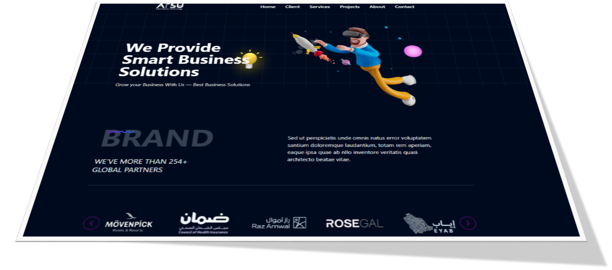

# ATSU Landing Page

This is a landing page for the ATSU (Addis Towns and Subcities) project. It is built using React and Tailwind CSS.

## Features

- Responsive design
- Navigation menu
- Hero section with image and text
- Call-to-action button
- Footer with social media links

## Installation

1. Clone the repository: `https://github.com/Pritam1121/landing-page_atsu.git`
2. Install dependencies: `npm install`
3. Start the development server: `npm run dev`

## Usage

To run the project locally, follow the installation steps above. The landing page will be available at `http://localhost:5173/`.

## Technology

1. React
2. Javascript
   
## Style
1.CSS
2.Tailwind
3.DaisyUI

## View 

## Live URL
[Click here](https://atsulandingpage.netlify.app/)
